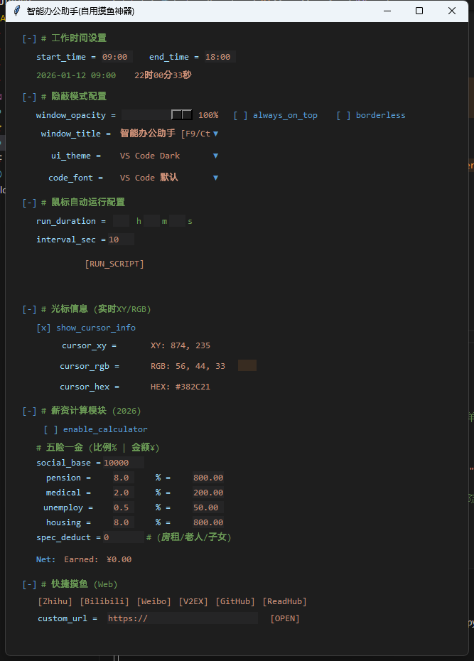
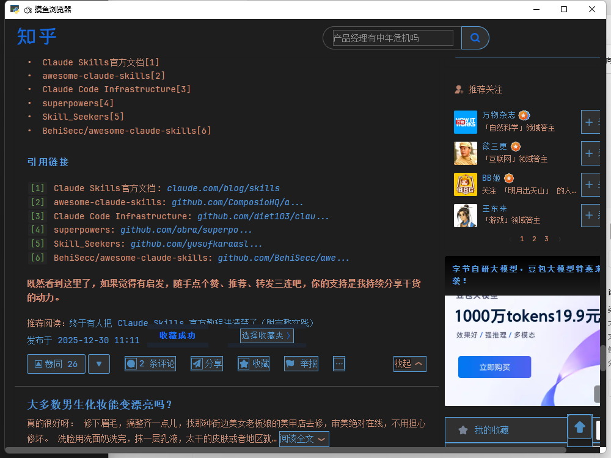
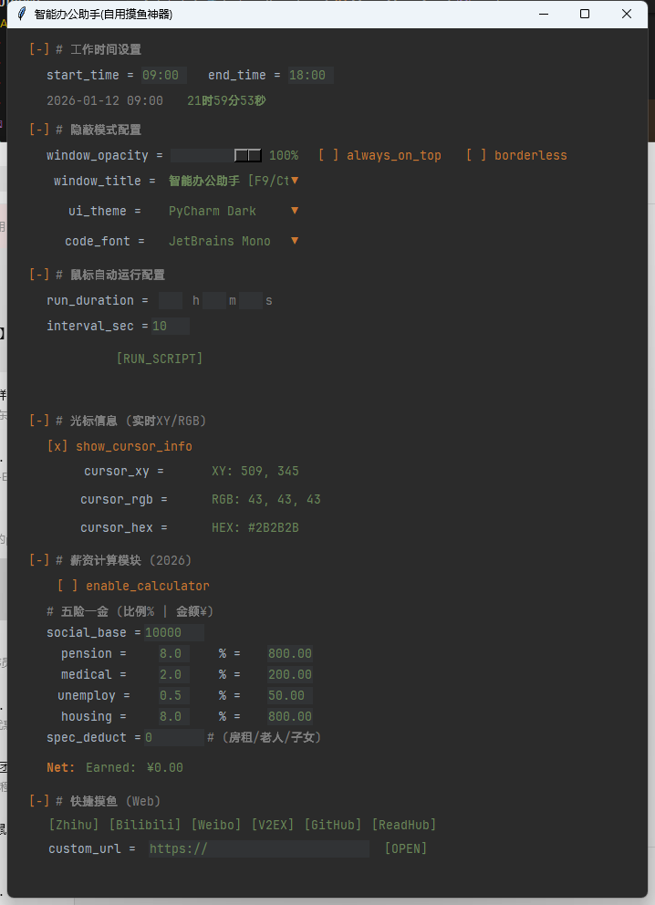
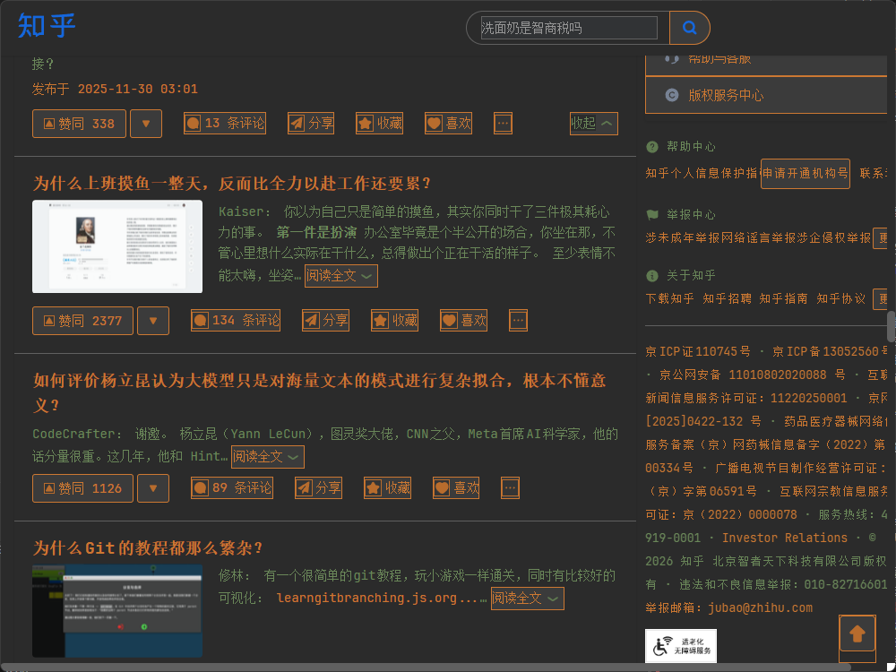

# AutoFish 智能办公助手

<p align="center">
  
</p>

> **Loaf on the job, responsibly.**
> 一个隐蔽、安全、功能强大的摸鱼辅助工具，专为现代打工人设计。

## ✨ 核心亮点

- **🐟 智能防息屏 (Mouse Jiggler)**: 模拟真实鼠标轨迹，防止电脑因长时间未操作而锁屏或休眠。
- **💰 实时薪资计算器**: 看着工资每一秒都在增加，是枯燥工作中的最大动力。支持自定义月薪、工作日及五险一金扣除。
- **👻 隐蔽模式 (Stealth Mode)**:
  - **透明度调节**: 随时调整窗口透明度，像幽灵一样存在。
  - **老板键 (Boss Key)**: 一键隐藏/呼出 (`F9` 或 `Ctrl+Alt+H`)。
  - **伪装标题**: 将窗口标题伪装成 "系统更新"、"会议纪要" 或代码编辑器。
  - **无边框**: 融入桌面环境，极简视觉体验。
- **🎨 极客风格 UI**: 默认提供 "VS Code Dark" 深色主题，界面像代码编辑器一样专业，不易被旁人察觉。

## 🚀 快速开始

### 方式一：直接运行 (推荐)

下载 [Releases](https://github.com/kkkano/AutoFish/releases) 中的 `LoafOnTheJob.exe`，双击即可运行。

### 方式二：从源码运行

```bash
# 安装依赖
pip install -r requirements.txt

# 运行
python loaf-on-the-job.py
```

## 🧰 轻量化打包

项目附带 `build_exe_minimal.py`，通过 PyInstaller + `LoafOnTheJob.spec` 生成一个 `dist/LoafOnTheJob.exe` 的最小体积副本。
默认启用了 `onefile=True`、UPX（如已安装）、`strip=True` 和 `optimize=2`，运行前可以加装 [UPX 压缩工具](https://upx.github.io/)，再执行：

```bash
python build_exe_minimal.py
```

脚本会清理老的 `build/` `dist/` 目录，生成单个 exe，并打印最终体积以供参考。

## ⚙️ 功能展示

### 🎞️ 交互演示

<p align="center">
  
  <br/>
  <em>隐蔽模式、薪资计算、鼠标移动等模块在同一窗口中协调工作</em>
</p>

### 🎨 主题预览

**VS Code 深色主题 (默认)**
<p align="center">
  
  <br/>
  <em>代码风格界面，适合在写字楼 / 开发者桌面上隐藏</em>
</p>

**VS Code 中文界面仿装**
<p align="center">
  
  <br/>
  <em>伪装成中文编辑界面，降低同事注意力</em>
</p>

**PyCharm 深色主题**
<p align="center">
  
  <br/>
  <em>替换颜色、字体后仍保持原生 Python 体验</em>
</p>

**PyCharm 中文界面**
<p align="center">
  
  <br/>
  <em>混合中文界面与代码展示，增加伪装自然度</em>
</p>

### 1. 五险一金计算
内置 2026 标准五险一金计算器，精确计算税后收入，让每一次摸鱼都心中有数。

## 🛠️ 配置说明
首次运行后生成的 `config.json` 可配置以下项：
- `work_days`: 每月工作天数
- `monthly_salary`: 税前月薪
- `title_presets`: 自定义伪装标题列表

## 📦 项目结构

```
AutoFish/
├── loaf-on-the-job.py    # 主入口
├── autofish/
│   ├── app.py            # 主应用程序
│   ├── config.py         # 配置管理
│   ├── utils.py          # 工具函数
│   └── modules/
│       ├── mouse.py      # 鼠标模拟模块
│       ├── salary.py     # 薪资计算模块
│       └── browser.py    # 浏览器模块
├── icons/                # 图标资源
└── requirements.txt      # 依赖列表
```

## 📄 License

MIT License

---
